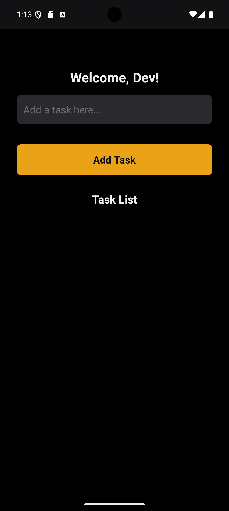
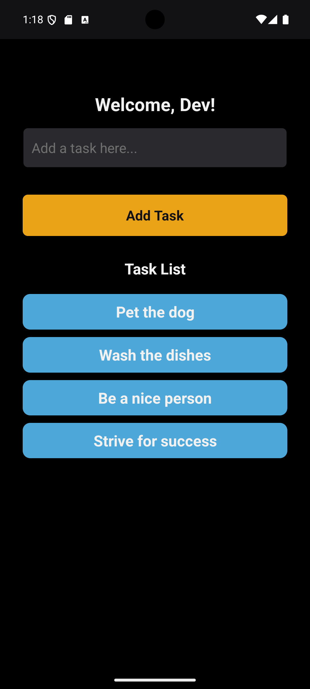
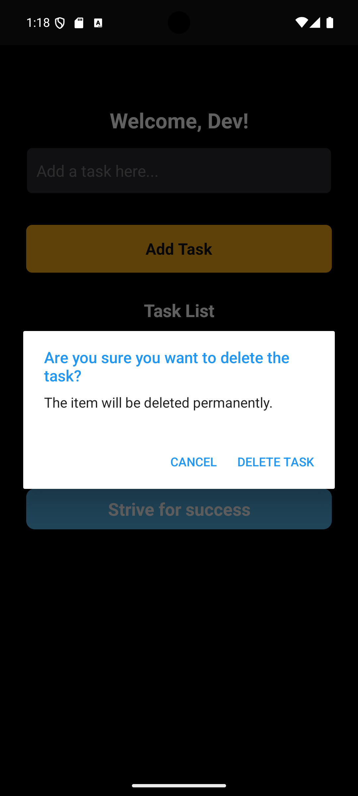

# Task List App

Welcome to the **Task List App**! This app is designed to help users efficiently manage their to-do items. Users can add tasks, view them in a list, and remove them by simply tapping on each item. Tasks are saved locally using AsyncStorage, making them accessible offline, and there's an option to load tasks from an external API.

This is a new [**React Native**](https://reactnative.dev) project, bootstrapped using [`@react-native-community/cli`](https://github.com/react-native-community/cli) and written in **TypeScript**.

## Features

* **Local Task Storage**: Uses React Native AsyncStorage to persist tasks.
* **Easy Task Removal**: Tasks can be deleted with a simple tap.
* **API Integration (Optional)**: An optional method in the `services` folder fetches tasks from a public API using JavaScript’s Fetch.
* **User-Friendly Interface**: Intuitive UI designed with TouchableOpacity buttons and styled components.

## Libraries Used

* [React Native Async Storage](https://reactnative.dev/docs/asyncstorage) - For local data persistence.
* [React-native-splash-screen](https://github.com/crazycodeboy/react-native-splash-screen) - For managing splash screens.
* [Jest](https://jestjs.io/) - For testing components and functionality.

## Getting Started

>**Note**: Before proceeding, ensure you've completed the [React Native - Environment Setup](https://reactnative.dev/docs/environment-setup) guide up to the "Creating a new application" step.

### Step 1: Start the Metro Server

Metro is the JavaScript bundler that ships with React Native. To start it, open a terminal in the project root and run:

```bash
# using npm
npm start

# OR using Yarn
yarn start
```

### Step 2: Start your Application

Keep Metro Bundler running in its own terminal. In a new terminal, use the following command to start the Android or iOS app:

#### For Android

```bash
# using npm
npm run android

# OR using Yarn
yarn android
```

#### For iOS

```bash
# using npm
npm run ios

# OR using Yarn
yarn ios
```

Alternatively, you can run the app directly from **Android Studio** (for Android) or **Xcode** (for iOS).

### Step 3: Modifying your App

Once the app is running, you can make changes and see them reflected in real-time:

1. Open `App.tsx` in your text editor.
2. For Android, press <kbd>R</kbd> twice or select **"Reload"** from the **Developer Menu** (accessible with <kbd>Ctrl</kbd> + <kbd>M</kbd> on Windows/Linux or <kbd>Cmd ⌘</kbd> + <kbd>M</kbd> on macOS).
3. For iOS, press <kbd>Cmd ⌘</kbd> + <kbd>R</kbd> in the iOS Simulator to reload the app.

### Usage

* **Add Task**: Type a task in the input field and press "Add Task" to save it.
* **Delete Task**: Tap on a task to remove it from the list.
* **Fetch Tasks**: Enable fetching from the API (optional) in the `services` folder to populate the list with predefined tasks.

## Screenshots

Below are some screenshots to give you a preview of the Task List App in action. Add your screenshots to `\MyTasksApp\resources\screenshots` and they will display here:

1. 
2. 
3. 

## Troubleshooting

If you encounter any issues, refer to the [React Native Troubleshooting Guide](https://reactnative.dev/docs/troubleshooting).

## Learn More

To dive deeper into React Native, explore the following resources:

* [React Native Website](https://reactnative.dev) - Comprehensive documentation.
* [Getting Started](https://reactnative.dev/docs/environment-setup) - Environment setup guide.
* [Learn the Basics](https://reactnative.dev/docs/getting-started) - React Native essentials.
* [React Native Blog](https://reactnative.dev/blog) - Latest official blog posts.

## Contributing

Contributions are welcome! If you'd like to improve the project, please fork the repository, make your changes, and submit a pull request.
